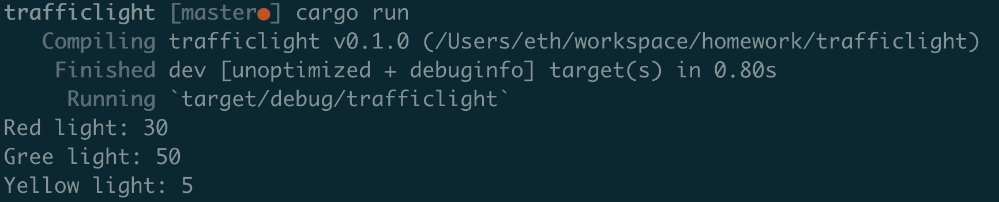

### Traffic Light


### Code 

```

fn main() {
    let red = TrafficLight::Red(30);
    println!("Red light: {}", red.time());
    let green = TrafficLight::Green(50);
    println!("Gree light: {}", green.time());
    let yellow = TrafficLight::Yellow(5);
    println!("Yellow light: {}", yellow.time());
}

trait TrafficLightTime {
    fn time(&self) -> u8 {
        unimplemented!();
    }
}

#[derive(Debug)]
enum TrafficLight {
    Red(u8),
    Green(u8),
    Yellow(u8)
}

impl TrafficLightTime  for TrafficLight  {
    fn time(&self) -> u8 {
        match *self {
            TrafficLight::Red(red) => red,
            TrafficLight::Green(green) => green,
            TrafficLight::Yellow(yellow) => yellow,
        }
    }
}

```
